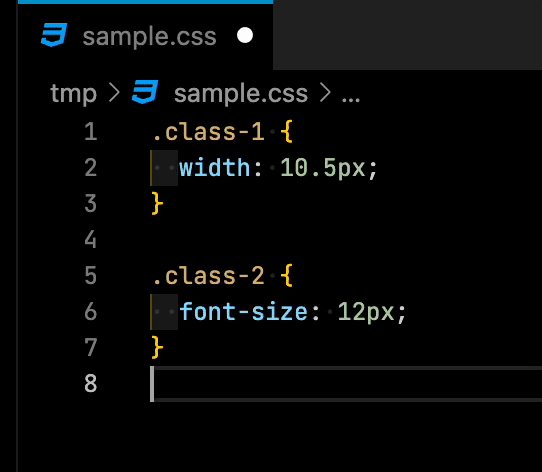

# VSCode px to rem

This is a VSCode extension that just converts px in CSS to rem.

  

The values you can set in the `settings.json` are down below.

- `px-to-rem.pxPerRem`: `number`

  the px -> rem conversion rate.

  Example: when the value is `10`, `10px` will be replaced with `1rem`.

- `px-to-rem.formatOnSave`: `boolean`

  When true, all the `px` parts in the active file will be replaced to `rem` soon after your save the file.
